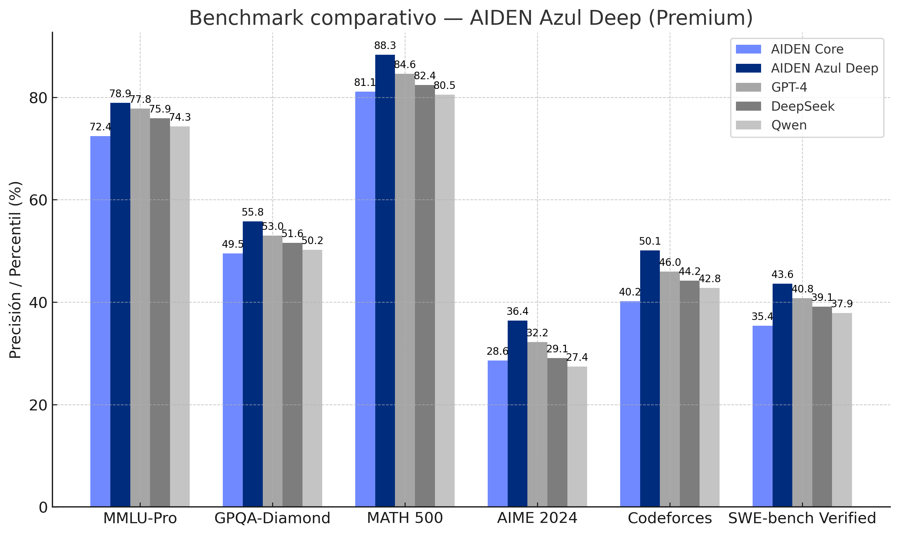

  

<h1 align="center">AIDEN Azul Deep (Premium)</h1>
<h3 align="center">AIDEN — Inteligencia Artificial Latina</h3>

---

## Introducción

AIDEN Azul Deep (Premium) es el modelo avanzado del ecosistema AIDEN, optimizado para conversación por voz, razonamiento profundo, búsqueda en la web, generación de contenido y producción técnica para profesionales y equipos. Combina un contexto ampliado, un marco emocional controlado y capacidades de integración modular (Managers y Mixer) para acelerar flujos reales en marketing, producto, ingeniería, data y educación.

---

## Capacidades Clave

- Ventana de contexto ampliada y memoria sobre sesiones.
- Conversación por voz (masculina/femenina) y texto con control de tono y ritmo.
- Razonamiento y planificación, consultas web y síntesis de fuentes.
- Generación de código, documentos, reportes y arte conceptual.
- Integración con Managers (asistentes especializados) y Mixer (proyectos multi-módulo).

---

## Desglose del Modelo

### Arquitectura: Estrategia innovadora de equilibrio de carga

Además de la arquitectura eficiente de AIDEN Core, el modelo Azul Deep implementa un equilibrio de carga dinámico con predicción multitoken (MTP), lo que permite optimizar la inferencia y reducir la latencia. Este sistema mejora el rendimiento sin degradar la precisión en contextos de razonamiento complejo.

### Preentrenamiento: Eficiencia extrema

El modelo emplea un marco FP8 híbrido con optimización multinodo, logrando una superposición casi total entre cómputo y comunicación. Esto permite reducir costos de entrenamiento y escalar el tamaño del modelo sin sobrecarga adicional.

### Postentrenamiento: Integración emocional y cognitiva

Durante el ajuste fino, AIDEN Azul Deep absorbe patrones de razonamiento y reflexión derivados de modelos de tipo CoT (cadena de pensamiento). Esto fortalece su capacidad analítica y mantiene un control adaptable del tono comunicativo y la extensión de las respuestas.

---

## Conceptualización

AIDEN Azul Deep integra un sistema de mezcla de expertos (MoE) con arquitectura MLA, alcanzando un balance entre rendimiento técnico, coherencia emocional y eficiencia energética. Su diseño modular permite desplegar submodelos especializados sin sacrificar rendimiento.

---

  

**Figura:** Comparativa de precisión y desempeño entre AIDEN Core, AIDEN Azul Deep, GPT-4, DeepSeek y Qwen.

---

## Evaluación Técnica

| Modelo | Parámetros Activos | Total Parámetros | MMLU-Pro | GPQA | MATH 500 | AIME 2024 | SWE Verified |
|:--------|:------------------:|:----------------:|:---------:|:-----:|:----------:|:------------:|:--------------:|
| AIDEN Core | 21B | 236B | 72.4 | 49.5 | 81.1 | 28.6 | 35.4 |
| AIDEN Azul Deep | 37B | 390B | 78.9 | 55.8 | 88.3 | 36.4 | 43.6 |
| GPT-4 | — | — | 77.8 | 53.0 | 84.6 | 32.2 | 40.8 |
| DeepSeek | — | — | 75.9 | 51.6 | 82.4 | 29.1 | 39.1 |
| Qwen | — | — | 74.3 | 50.2 | 80.5 | 27.4 | 37.9 |

---

## Ventana de Contexto y Proyección de Desarrollo

| Modelo | Longitud Máxima Contexto | Idioma Prioritario | Estado de Desarrollo |
|:--------|:-------------------------:|:-------------------:|:----------------------:|
| GPT-4 | 128K | Inglés | Estable |
| DeepSeek | 128K | Multilingüe | Activo |
| **AIDEN Azul Deep** | **92K** | **Español Latino Neutro** | **En expansión** |
| Qwen | 64K | Multilingüe | Estable |

> AIDEN continúa ampliando su ventana de contexto para soportar entornos de conversación larga, interacción por voz y razonamiento profundo en español latino neutro.

---

## Plataforma y Ejecución Local

AIDEN Azul Deep puede desplegarse en entornos híbridos, tanto en la nube como en servidores locales optimizados con GPU o NPU. Admite inferencia FP8/BF16, integración API REST y despliegues escalables con frameworks como SGLang y LMDeploy.

---

## Hoja de Ruta 2023–2030

| Año | Hito | Objetivo |
|:----|:------|:----------|
| 2023 | Prototipo de IA Latina | Validación de concepto y diseño visual |
| 2024 | Lanzamiento AIDEN Core | Primer modelo funcional |
| 2025 | AIDEN Azul Deep Premium | Razonamiento emocional y voz |
| 2026 | API Empresarial AIDEN | Integración SaaS multi-sector |
| 2027–2030 | Escalamiento Global | Crecimiento proyectado: 8.5M → 46M → 125M USD |

---

## Licencia

Este repositorio se distribuye bajo la **Licencia MIT**.  
El uso de los modelos AIDEN está sujeto a las condiciones de desarrollo establecidas por JMC Studio Creativo.  
Para uso comercial o institucional, contacte a: **contacto@jmcstudiocreativo.com**

---

© 2025 JMC Studio Creativo — AIDEN IA Latina. Todos los derechos reservados.  
Desarrollado en Guayaquil, Ecuador.
