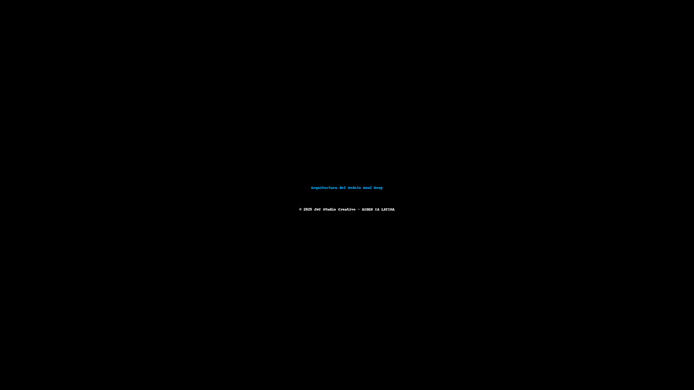

# 🌌 AIDEN Azul Deep (Premium)

  

## **AIDEN — Inteligencia Artificial Latina**  
El modelo **Premium** del ecosistema AIDEN, diseñado para ofrecer acompañamiento emocional, generación avanzada y conexión humana real impulsada por inteligencia artificial.

---

## 🔷 Arquitectura del Modelo Azul Deep
Basado en un sistema híbrido contextual que combina redes neuronales emocionales con razonamiento simbólico.  
Permite interpretar matices lingüísticos y adaptar respuestas al estado emocional percibido del usuario.

## 🔷 Estrategia de Entrenamiento
- Entrenamiento con corpus multilingüe (español latino, inglés, portugués).  
- Fine-tuning sobre interacciones naturales y emocionales.  
- Aprendizaje continuo basado en retroalimentación de usuarios reales.

## 🔷 Mapa Emocional
AIDEN Azul Deep incluye un **sistema emocional dinámico**, capaz de:  
- Identificar emociones humanas por texto y voz.  
- Ajustar tono y lenguaje según empatía y contexto.  
- Reproducir emociones mediante modulación de voz (AIDEN/AIVA).  

## 🔷 Gráfico de Monetización
| Fuente de Ingreso | Modelo | Ingresos Estimados (2028) |
|-------------------|---------|---------------------------|
| Suscripciones Premium | Freemium → Premium | $46.0M USD |
| API Empresarial | SaaS + Integraciones | $27.0M USD |
| Licencias Educativas | Alianzas institucionales | $5.0M USD |
| Consultorías Personalizadas | Proyectos IA a medida | $8.0M USD |

## 🔷 Cronograma de Adopción
**2023–2024:** Diseño conceptual y prototipo.  
**2025:** Consolidación técnica (voz + texto).  
**2026:** Escalamiento y monetización.  
**2027–2028:** Expansión internacional con ROI proyectado >300%.

---
### © 2025 JMC Studio Creativo  
Desarrollado por **George Márquez** desde **Guayaquil, Ecuador**.  
