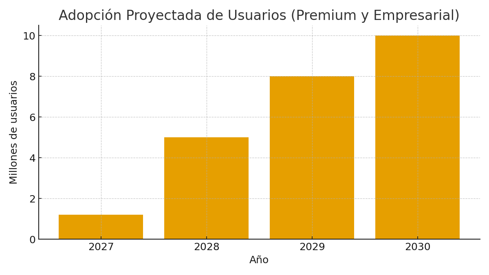

  

# Adopción Global y Despliegue
AIDEN — Inteligencia Artificial Latina

## Estrategia de mercado
- Go-to-market en LATAM con foco en voz en español.
- Expansión a EE.UU. y Europa mediante partners.
- Casos de uso: educación, marketing, soporte, analítica.

## Indicadores objetivo
- 2027: 500K - 1.2M usuarios 
- 2028: 5.0M usuarios / premium.
- 2029–2030: 10 – 15M usuarios combinados activos / premium / enterprise.

---

© 2025 JMC Studio Creativo — AIDEN IA Latina. Todos los derechos reservados. Desarrollado en Guayaquil, Ecuador.

