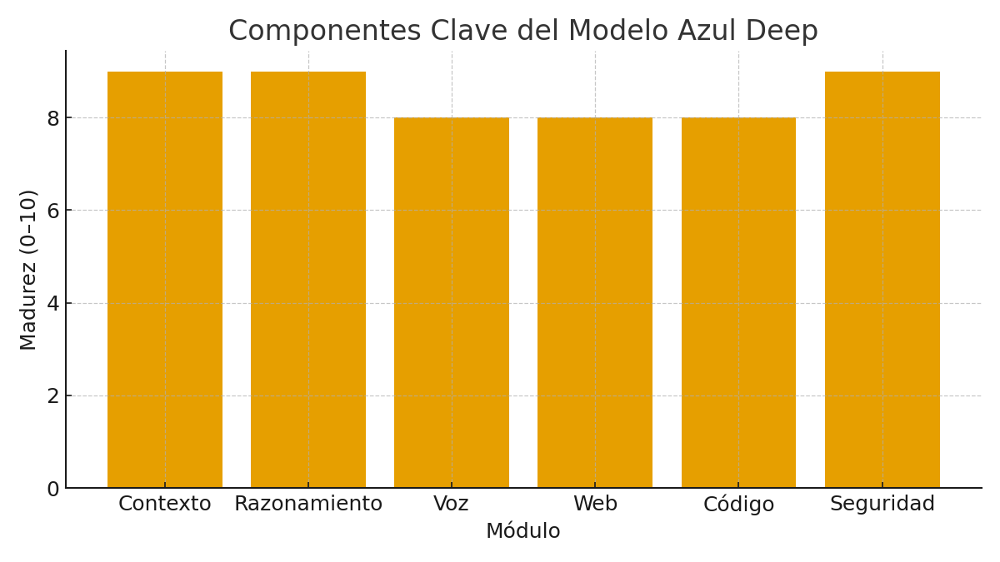

  

# Comparativa Técnica y Benchmarks
AIDEN — Inteligencia Artificial Latina

## Tabla de referencia (indicativa)
| Modelo | Contexto (tokens) | Razonamiento | Voz nativa | Web | Código | Seguridad |
|-------|--------------------|--------------|-----------|-----|-------|-----------|
| AIDEN Azul Deep | Alto | Alto | Sí | Sí | Sí | Alto |
| DeepSeek (ref.) | Medio | Alto | No | Sí | Sí | Alto |
| Qwen (ref.) | Medio | Medio | Opcional | Sí | Sí | Alto |
| GPT* (ref.) | Alto | Muy alto | Opcional | Sí | Sí | Alto |

## Criterios
- **Razonamiento:** exactitud factual y multi-paso.
- **Contexto:** retención y coherencia.
- **Voz:** prosodia, latencia y control.
- **Seguridad:** políticas y auditoría.

---

© 2025 JMC Studio Creativo — AIDEN IA Latina. Todos los derechos reservados. Desarrollado en Guayaquil, Ecuador.

