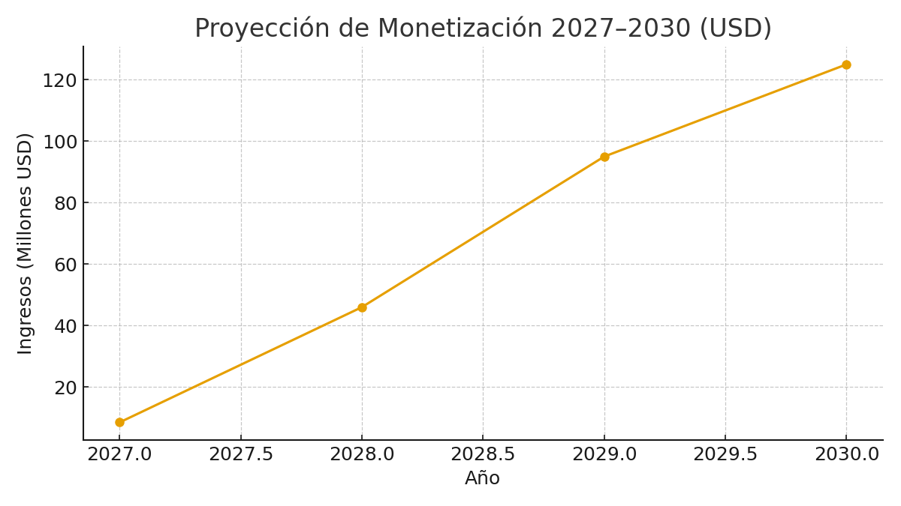

  

# Monetización y Proyecciones (2027–2030)
AIDEN — Inteligencia Artificial Latina

## Resumen
- 2027 (últimos 6 meses): USD 8.5M
- 2028: USD 46M
- 2029–2030: USD 125M consolidado

## Palancas de ingresos
- Suscripciones Premium (Azul Deep).
- Integraciones empresariales y proyectos a medida.
- Licencias de API e institucionales.

---

© 2025 JMC Studio Creativo — AIDEN IA Latina. Todos los derechos reservados. Desarrollado en Guayaquil, Ecuador.

