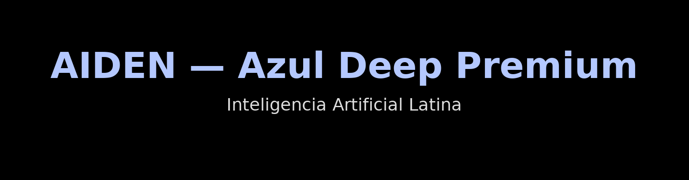

  

# Roadmap 2023–2030
AIDEN — Inteligencia Artificial Latina

## Hitos
- **2023–2024:** Concepto, diseño, primeras pruebas.
- **2025:** Prototipo funcional, documentación pública.
- **2026:** Desarrollo integral, equipo y plataforma propia.
- **2027:** Testeo, lanzamiento y monetización inicial.
- **2028–2030:** Escala global y consolidación.

---

© 2025 JMC Studio Creativo — AIDEN IA Latina. Todos los derechos reservados. Desarrollado en Guayaquil, Ecuador.

